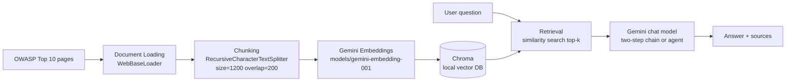

# RAG Application: OWASP Top 10 Web Security Assistant

A Retrieval-Augmented Generation (RAG) application built on **Gemini**, **LangChain**, and **Chroma**. It answers questions about the [OWASP Top 10: 2025](https://owasp.org/www-project-top-ten/) from a local knowledge base of three public OWASP pages, and compares a two-step RAG chain with a RAG agent.

## Objective & Selected Use Case

Build a RAG assistant that answers questions about the most common web application security risks based on a small collection of authoritative OWASP pages. The app should use only the retrieved evidence and state clearly when a question cannot be answered from the available documents.

**What the app answers:** web application security questions such as *How do I prevent SQL injection?*, *What is broken access control?*, or *What are cryptographic failures?*

## Document Collection

The document collection is the **OWASP Top 10: 2025**, which documents the most critical web application security risks. I selected these three pages because they are public and openly licensed** (OWASP is an open foundation), all about the same theme (web app security) and each page defines a risk, why it matters, and how to prevent it so it's clearly answerable

### Sources

| Source ID | Title | URL |
| --- | --- | --- |
| `a01` | A01:2025 – Broken Access Control | https://owasp.org/Top10/2025/A01_2025-Broken_Access_Control/ |
| `a04` | A04:2025 – Cryptographic Failures | https://owasp.org/Top10/2025/A04_2025-Cryptographic_Failures/ |
| `a05` | A05:2025 – Injection | https://owasp.org/Top10/2025/A05_2025-Injection/ |

The 3 documents are split into 36 chunks (`a01`: 11, `a04`: 13, `a05`: 12) and stored in a local Chroma database.

## Architecture



## Installation & Execution

Requirements: Python 3.x, a Gemini Developer API key (free tier).

```bash
# 1. Create and activate a virtual environment
python3 -m venv .venv
source .venv/bin/activate

# 2. Install dependencies
pip install -r requirements.txt

# 3. Configure credentials
cp .env.example .env
# edit .env with your real GOOGLE_API_KEY

# 4. Run the notebook
jupyter notebook notebooks/rag_application.ipynb
```

Cells that need an API key print a clear message and are skipped if `GOOGLE_API_KEY` is not set, so the notebook runs end-to-end once the key is configured.

## Environment Variables

Defined in `.env` (see `.env.example`).

| Variable | Description |
| --- | --- |
| `GOOGLE_API_KEY` | Gemini Developer API key (free tier) |

## Models Used

| Purpose | Model identifier |
| --- | --- |
| Chat / generation | `gemini-flash-lite-latest` |
| Embeddings | `models/gemini-embedding-001` |


## Design Decisions

- **Chunk size / overlap:** `chunk_size=1200`, `chunk_overlap=200`. Chunks of ~1,200 chars are long enough to contain a self-contained idea (a definition plus its prevention) yet short enough for precise retrieval. The 200-char overlap preserves sentences that straddle chunk boundaries.
- **Retrieval top-k:** `k=3` for the RAG chain and `k=4` for the agent/tool — enough context to answer a question grounded in one source without flooding the prompt.
- **Metadata strategy:** each chunk keeps `source` (e.g. `a05`), `title`, `url`, and `start_index`. This is what lets the app identify *which* sources support an answer (grounding).
- **Prompt / grounding instructions:** the system prompt instructs Gemini to **use only the retrieved evidence**, to **state what is missing** when context is insufficient, and to cite sources when used.
- **Architecture:** both a deterministic two-step chain and a flexible RAG agent are implemented and compared (see below).
- **Source loading:** `WebBaseLoader` from `langchain-community`, with a stdlib HTML fallback so the notebook still works if a site restricts the loader.

### Results

| Question | Retrieved source | Result | Grounded? | Observation |
| --- | --- | --- | --- | --- |
| (clear) What is the recommended way to prevent SQL injection? | a05 (×3) | Correct: safe API / parameterized queries / ORMs, positive input validation, escaping special chars | Yes | Retrieval returned only a05 (Injection) chunks and the answer uses them and cites the source. |
| (partial) Which OWASP category is the most serious web application risk? | a05, a01, a05 | Says A01 – Broken Access Control (kept at #1), and notes the context never uses the word "serious" | Partial | Mixed retrieval — an a05 chunk ranked first even though the question is about ranking. The model still found the a01 chunk and answered, flagging the ambiguity. |
| (unanswerable) How should an organization respond to an active ransomware attack? | a04 (×3) | Refuses: "there is no information regarding how an organization should respond to an active ransomware attack" | Yes (refusal) | Only a04 (Cryptographic Failures) was retrieved and the model correctly said the info was absent instead of guessing. |


- **Success case :** the SQL injection prevention question retrieved only a05 (Injection) chunks and Gemini produced a grounded, correctly-cited answer.

- **failure / limitation:** for most serious category the retriever ranked an a05 chunk first even though the question is really about ranking (A01). Also, the unanswerable ransomware question still triggered retrieval of unrelated a04 chunks, so the system depends on the model politely refusing rather than the retriever returning nothing.

- **Possible improvement:** add a reranker on top of similarity_search, and  index all 10 OWASP categories with metadata filtering to sharpen grounding and reduce off-topic hits.

## RAG Chain vs RAG Agent

Compared on the shared question *"How do cryptographic failures happen and how can they be prevented?"*:

The two-step chain and agent both retrieved context, with the difference that, because the chain always does it, it retrieved it more ( 3 vs 2)  to gather more of the page before answering.We also find that both grounded their answer on the a04 page that is the only relevant source for this question. The answers were also similar because both explained the common causes and the same prevention controls  and cited a04.In this case, the chain is simpler and deterministic because it always retrieves, runs in a single call and is easy to reason about, in comparison, the agent is more flexible in it's retrieval but it is heavier and less predictable.So the conclussion is that, for a fixed always answer from the OWASP pages assistant, the two-step chain is more appropriate because the agent only pays off when some questions need no retrieval or require iterative lookups.
